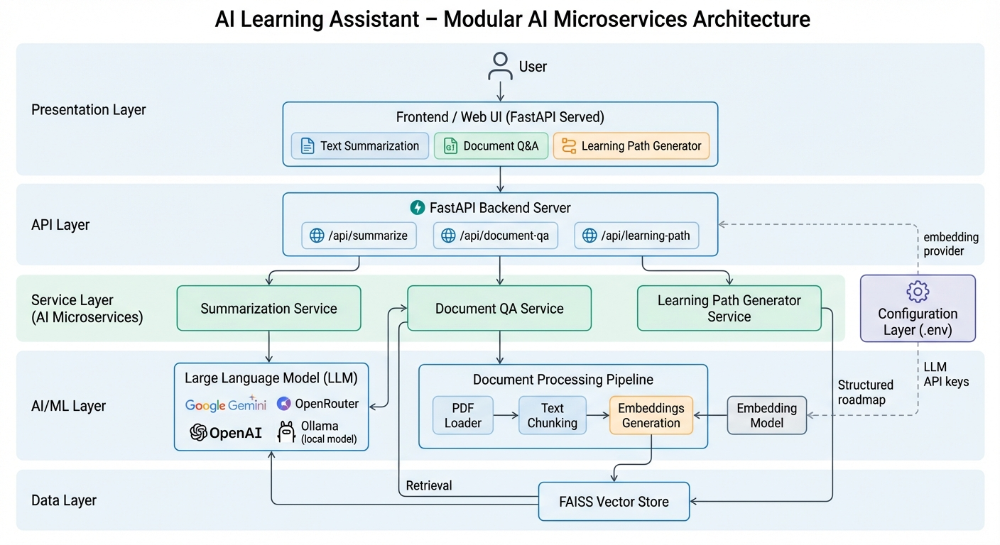

# AI Learning Assistant – Modular AI Microservices

A **production-quality** internship project implementing **AI microservices** with **FastAPI**, **LangChain**, and **FAISS**. The system exposes REST APIs for text summarization, document question answering, and dynamic learning path generation.

---

## Table of Contents

- [Project Overview](#project-overview)
- [Architecture](#architecture)
- [Features](#features)
- [Technology Stack](#technology-stack)
- [Installation](#installation)
- [Environment Variables](#environment-variables)
- [Running the API Server](#running-the-api-server)
- [API Endpoints](#api-endpoints)
- [Prompt Engineering](#prompt-engineering)
- [Example API Requests](#example-api-requests)
- [Postman Collection](#postman-collection)
- [Flowise Integration (Bonus)](#flowise-integration-bonus)

---

## Project Overview

This project delivers **three AI microservices** behind a single FastAPI application:

| Service | Endpoint | Purpose |
|--------|----------|---------|
| **Text Summarization** | `POST /api/summarize` | Summarize long text into concise explanations (under 100 words). |
| **Document QA** | `POST /api/document-qa` | Upload a PDF and ask questions; answers are based only on document content. |
| **Learning Path Generator** | `POST /api/learning-path` | Generate structured learning roadmaps (beginner → advanced + resources). |

The codebase follows **clean architecture**: routes handle HTTP, services contain AI logic, and shared utilities provide embeddings and prompt templates. This makes the project easy to evaluate, extend, and run locally.

---

## System Architecture



**Separation of concerns:**

- **Routes**: Request validation, error handling, JSON responses.
- **Services**: All AI logic (LLM calls, document loading, FAISS, chains).
- **Utils**: Reusable prompts and embeddings configuration.
- **Config**: Centralized settings from environment variables.

---

## Features

- **Text Summarization**: Professional summarizer role, under 100 words, no hallucination.
- **Document QA**: PDF upload, PyPDFLoader, chunking, FAISS, RetrievalQA; answers only from document; "Information not found in the document" when uncertain.
- **Learning Path**: Structured JSON roadmap (beginner, intermediate, advanced, resources, timeline) with mentor-style prompts.
- **Multi-LLM support**: OpenAI, OpenRouter, or Ollama via `LLM_PROVIDER` and `.env`.
- **Modular design**: Easy to add new services or swap models.

---

## Technology Stack

| Layer | Technology |
|-------|------------|
| Backend | Python 3.10+, FastAPI, Uvicorn |
| AI / Chains | LangChain, LangChain Community, LangChain OpenAI |
| Document | PyPDFLoader, RecursiveCharacterTextSplitter |
| Vector DB | FAISS (in-memory) |
| LLM | OpenAI API, OpenRouter API, or Ollama |
| Embeddings | OpenAI Embeddings or Ollama (e.g. nomic-embed-text) |
| Config | python-dotenv, pydantic-settings |

---

## Installation

### Prerequisites

- **Python 3.10+**
- **pip** (or conda)

### Steps

1. **Clone or download** the project and go to the `server` directory:

   ```bash
   cd server
   ```

2. **Create a virtual environment** (recommended):

   ```bash
   python -m venv venv
   # Windows
   venv\Scripts\activate
   # macOS/Linux
   source venv/bin/activate
   ```

3. **Install dependencies**:

   ```bash
   pip install -r requirements.txt
   ```

4. **Configure environment** (see [Environment Variables](#environment-variables)):

   ```bash
   copy .env.example .env   # Windows
   # cp .env.example .env   # macOS/Linux
   ```

   Edit `.env` and set at least:

   - `LLM_PROVIDER` (e.g. `openai`, `openrouter`, or `ollama`)
   - For OpenAI: `OPENAI_API_KEY`, optionally `OPENAI_MODEL`
   - For OpenRouter: `OPENROUTER_API_KEY`, `OPENROUTER_MODEL`
   - For Ollama: ensure Ollama is running and set `OLLAMA_MODEL`
   - For Document QA: `EMBEDDINGS_PROVIDER` and, if OpenAI, `OPENAI_API_KEY`

---

## Environment Variables

| Variable | Description | Example |
|----------|-------------|---------|
| `LLM_PROVIDER` | LLM to use: `openai`, `openrouter`, `ollama` | `openai` |
| `OPENAI_API_KEY` | OpenAI API key (required if using OpenAI for LLM or embeddings) | `sk-...` |
| `OPENAI_MODEL` | OpenAI chat model | `gpt-4o-mini` |
| `OPENROUTER_API_KEY` | OpenRouter API key | — |
| `OPENROUTER_BASE_URL` | OpenRouter base URL | `https://openrouter.ai/api/v1` |
| `OPENROUTER_MODEL` | Model on OpenRouter | `openai/gpt-4o-mini` |
| `OLLAMA_BASE_URL` | Ollama server URL | `http://localhost:11434` |
| `OLLAMA_MODEL` | Ollama model name | `llama3.2` |
| `EMBEDDINGS_PROVIDER` | Embeddings: `openai` or `ollama` | `openai` |
| `OPENAI_EMBEDDINGS_MODEL` | OpenAI embeddings model | `text-embedding-3-small` |
| `DOCUMENT_CHUNK_SIZE` | Chunk size for document splitting | `1000` |
| `DOCUMENT_CHUNK_OVERLAP` | Overlap between chunks | `200` |

See `.env.example` for a full template.

---

## Running the API Server

From the `server` directory (with venv activated):

```bash
uvicorn app.main:app --reload
```

- API: **http://localhost:8000**
- Interactive docs: **http://localhost:8000/docs**
- ReDoc: **http://localhost:8000/redoc**

**Using the app:** Open **http://localhost:8000** in your browser to use the **web UI**. You can:
- **Summarize** – paste text and get a short summary
- **Document QA** – upload a PDF and ask a question
- **Learning Path** – enter a topic and get a structured roadmap

API info in JSON form is at **http://localhost:8000/api-info**.

To bind to a specific host/port:

```bash
uvicorn app.main:app --host 0.0.0.0 --port 8000 --reload
```

---

## API Endpoints

### 1. Text Summarization

**POST** `/api/summarize`

Summarizes long text into a concise summary (under 100 words).

**Request (JSON):**

```json
{
  "text": "Long paragraph or article to summarize..."
}
```

**Response (JSON):**

```json
{
  "summary": "Concise summary under 100 words."
}
```

---

### 2. Document Question Answering

**POST** `/api/document-qa`

**Content-Type:** `multipart/form-data`

| Field | Type | Description |
|-------|------|-------------|
| `document` | File | PDF file |
| `question` | String | Question about the document |

**Response (JSON):**

```json
{
  "answer": "Answer based only on document content, or 'Information not found in the document.'"
}
```

---

### 3. Dynamic Learning Path

**POST** `/api/learning-path`

**Request (JSON):**

```json
{
  "topic": "Machine Learning"
}
```

**Response (JSON):**

```json
{
  "roadmap": {
    "beginner": ["Item 1", "Item 2", ...],
    "intermediate": ["Item 1", "Item 2", ...],
    "advanced": ["Item 1", "Item 2", ...],
    "resources": ["Book X", "Course Y", ...],
    "timeline": "Beginner: 2-3 months, Intermediate: 3-4 months, Advanced: 4-6 months"
  }
}
```

---

## Prompt Engineering

Prompts are **structured** (role, task, rules, output format) and live in `app/utils/prompt_templates.py`. They are not raw user input.

### Structure Used in This Project

1. **Role definition** – Who the AI is (e.g. "professional academic summarizer", "document analyst", "technical mentor").
2. **Task** – What to do (summarize, answer from context, generate roadmap).
3. **Rules / constraints** – Word limit, no hallucination, document-only answers, JSON-only output.
4. **Output format** – e.g. "under 100 words", "say Information not found in the document", "return JSON with keys: beginner, intermediate, ...".

### Example (Summarization)

```
You are a professional academic summarizer...
Your task is to summarize the provided text...
Rules:
- Produce a clear, concise summary under 100 words.
- Maintain the core meaning...
- Do not add information not present in the source (no hallucination).
...
Text to summarize: {{user_input}}
```

This keeps behavior consistent and evaluable.

### Document QA Guardrails

- System prompt states: answer **only** from the given context.
- If the context does not contain the answer, the model is instructed to respond exactly: **"Information not found in the document."**
- Reduces hallucination and keeps answers document-grounded.

### Learning Path Output

- Model is instructed to return **valid JSON only** (no markdown fences).
- Keys: `beginner`, `intermediate`, `advanced`, `resources`, `timeline`.
- Service parses and normalizes the JSON and returns a structured `roadmap`.

---

## Example API Requests

### cURL – Summarize

```bash
curl -X POST "http://localhost:8000/api/summarize" \
  -H "Content-Type: application/json" \
  -d "{\"text\": \"Your long article or paragraph here...\"}"
```

### cURL – Document QA

```bash
curl -X POST "http://localhost:8000/api/document-qa" \
  -F "document=@/path/to/file.pdf" \
  -F "question=What is the main conclusion of this document?"
```

### cURL – Learning Path

```bash
curl -X POST "http://localhost:8000/api/learning-path" \
  -H "Content-Type: application/json" \
  -d "{\"topic\": \"Machine Learning\"}"
```

---

## Postman Collection

A Postman collection is provided: **`postman_collection.json`** in the `server` folder.

**Usage:**

1. Open Postman → **Import** → select `postman_collection.json`.
2. Set the collection variable `base_url` to `http://localhost:8000` (or your server URL).
3. Use the three requests:
   - **Summarize** – body: raw JSON with `text`.
   - **Document QA** – body: form-data with `document` (file) and `question` (text).
   - **Learning Path** – body: raw JSON with `topic`.

This allows evaluators to run and test all endpoints quickly.

---

## Flowise Integration (Bonus)

You can replicate the **Document QA** pipeline in **Flowise** as a visual workflow.

### Flowise setup

1. Install and start Flowise:

   ```bash
   npx flowise start
   ```

2. Open the UI (e.g. **http://localhost:3000**).

### Document QA pipeline in Flowise

Build a flow with these nodes:

| Step | Node / Component | Description |
|------|------------------|-------------|
| 1 | **PDF Loader** | Load PDF (file or URL). |
| 2 | **Text Splitter** | Split into chunks (e.g. Recursive Character Text Splitter, chunk size ~1000, overlap ~200). |
| 3 | **Embeddings** | OpenAI (or other) embeddings model. |
| 4 | **Vector Store** | Store embeddings (e.g. in-memory or FAISS if available). |
| 5 | **Retriever** | Retrieve top-k chunks for a question. |
| 6 | **LLM** | OpenAI / OpenRouter / Ollama with a prompt: "Answer only from the context. If not in context, say: Information not found in the document." |
| 7 | **Output** | Response to the user. |

**Flow (high level):**

```
PDF Loader → Text Splitter → Embeddings → Vector Store
                                      → Retriever → LLM → Response
                                                          (with document-only prompt)
```

The **prompt** in the LLM node should mirror `DOCUMENT_QA_SYSTEM` and `DOCUMENT_QA_USER` in `app/utils/prompt_templates.py`: role as document analyst, answer only from context, and "Information not found in the document" when uncertain.

---

## Project Structure

```
server/
├── app/
│   ├── main.py              # FastAPI app, CORS, route registration
│   ├── config.py            # Settings from .env
│   ├── routes/
│   │   ├── summarizer_routes.py
│   │   ├── document_routes.py
│   │   └── learning_routes.py
│   ├── services/
│   │   ├── ai_service.py    # get_llm() for OpenAI / OpenRouter / Ollama
│   │   ├── summarizer_service.py
│   │   ├── document_qa_service.py
│   │   └── learning_path_service.py
│   └── utils/
│       ├── prompt_templates.py
│       └── embeddings.py
├── requirements.txt
├── .env.example
├── postman_collection.json
└── README.md
```

---

## Code Quality

- **Modular architecture**: Routes to services to LLM/embeddings/utils.
- **Comments**: Docstrings and inline comments where useful.
- **Naming**: Clear function and variable names.
- **Error handling**: Try/except in services; routes return appropriate HTTP status and JSON errors.
- **Validation**: Pydantic models for request bodies and responses.

---

## License

This project is intended for educational and internship evaluation purposes.

---

**For evaluators:** After installing dependencies and configuring `.env`, run `uvicorn app.main:app --reload` from the `server` directory and use `/docs` or the Postman collection to test all three AI microservices.
